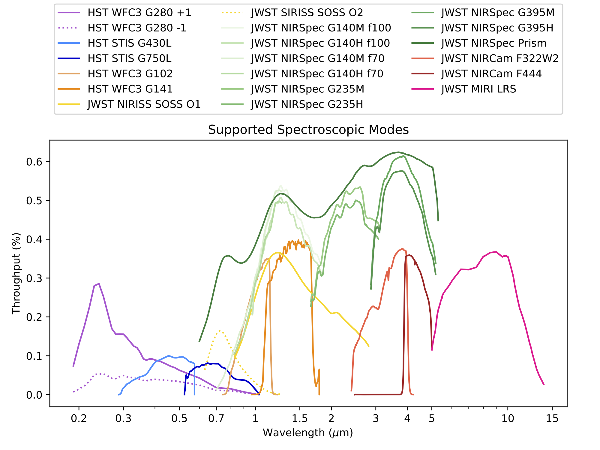
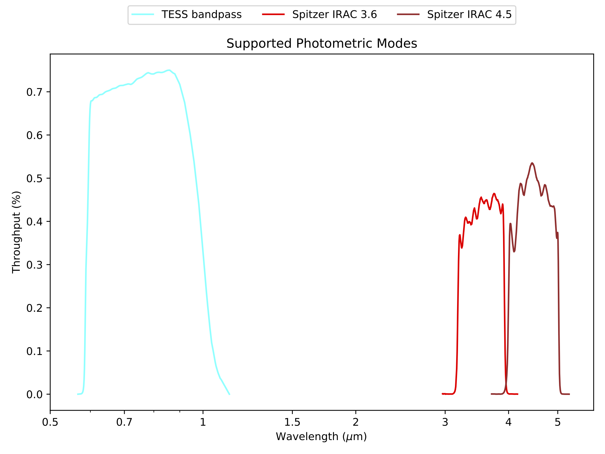

# ExoTiC-LD

<!-- ### This package is under development as it is being adapted from [ExoTiC-ISM](https://github.com/Exo-TiC/ExoTiC-ISM). For a current form of the limb-darkening calculator please go to that repository and follow the install and tutorials for use.  -->

**Exoplanet Timeseries Characterisation - Limb-Darkening**

Limb-darkening package to calculate the coefficients for specific instruments, stars, and wavelength ranges

This code calculates limb-darkening parameters using a range of functional forms, as outlined in [Claret (2010)](https://ui.adsabs.harvard.edu/abs/2000A%26A...363.1081C/abstract) and [Sing (2010)](https://ui.adsabs.harvard.edu/abs/2010A%26A...510A..21S/abstract).
This calculation is computed using 1D Kurucz stellar models or 3D stellar models for a smaller subset of parameters from [Magic et al. (2015)](https://ui.adsabs.harvard.edu/abs/2015A&A...573A..90M/abstract).

This package was built from the original IDL code adapted by Hannah Wakeford and translated into python by Matthew Hill with improvements by Iva Laginja. The git history associated with these steps can be found in the ExoTiC-ISM package from which this is a spin-off repository.

## Data
To run this package you will need to download the stellar model grids and supported instrument information from [ExoTiC-LD_data on zenodo](https://zenodo.org/record/6344946#.YistRy-l2ik)

<!-- Once downloaded un-zip and alter the filepath indicated in limb_darkening.py -->

## Install

This package is installable via pip using the following command

         pip install exotic-ld

Alternatively you can clone this repository and use this as a standard python script. 
     
## Supported instruments and gratings
Current supported instruments and gratings are:  

### Spectroscopic:
**Hubble** *STIS*: G750L, G750M, G430L gratings

**Hubble** *WFC3*: UVIS/G280+1, UVIS/G280-1, IR/G102, IR/G141 grisms

**Webb** *NIRSpec*: Prism, G395H, G395M, G235H, G235M, G140H-f100, G140M-f100, G140H-f070, G140M-f070

**Webb** *NIRISS*: SOSSo1, SOSSo2

**Webb** *NIRCam*: F322W2, F444

**Webb** *MIRI*: LRS

### Photometric:

**TESS**

**Spitzer** *IRAC*: Ch1 (3.6 microns), Ch2 (4.5 microns)

  
  

## About this repository

### Contributing and code of conduct

Please read [CONTRIBUTING.md](CONTRIBUTING.md) for contribution guidelines, and the process for submitting issues and pull requests to us.
Please also see our [CODE OF CONDUCT](CODE_OF_CONDUCT.md).

If you use this code in your work, please find citation snippets to give us credits with in [CITATION.txt](CITATION.txt).

### License

This project is licensed under the MIT License - see the [LICENSE.md](LICENSE.txt) file for details.

### Acknowledgments

* Hannah Wakeford for IDL code and adaption to an independent Python package - [@hrwakeford](https://github.com/hrwakeford)
* Matthew Hill for a functional translation from IDL to Python - [@mattjhill](https://github.com/mattjhill)
* Iva Laginja for implementing improvements to the script - [@ivalaginja](https://github.com/ivalaginja)
* Natasha Batalha for providing the Webb throughput information from their PandExo package - [@natashabatalha](https://github.com/natashabatalha)
* David Grant for making it pip installable - [@davogrant](https://github.com/DavoGrant)
* Lili Alderson for reviewing and testing - [@lili-alderson](https://github.com/lili-alderson)
