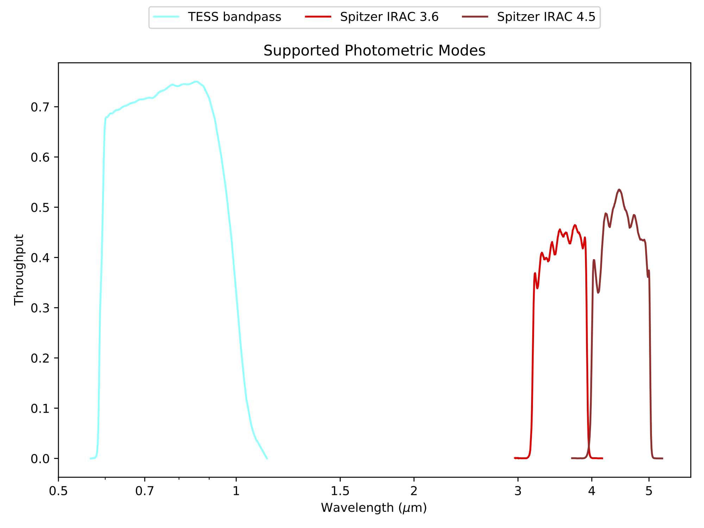

ExoTiC-LD
===========

**Calculate limb-darkening coefficients for specific instruments, stars, and wavelength ranges.**

.. image:: https://github.com/DavoGrant/ExoTiC-MIRI/workflows/unittests/badge.svg
   :target: https://github.com/DavoGrant/ExoTiC-MIRI/actions/workflows/python-app.yml
   
.. image:: https://readthedocs.org/projects/exotic-ld/badge/?version=latest
   :target: https://exotic-ld.readthedocs.io/en/latest/?badge=latest
   
.. image:: https://zenodo.org/badge/458261370.svg
   :target: https://zenodo.org/badge/latestdoi/458261370
|

::

   pip install exotic-ld

| Read the full documentation at: `exotic-ld.readthedocs.io <https://exotic-ld.readthedocs.io/>`_

|
ExoTiC-LD supports a range of pre-defined spectroscopic and photometric modes as well as custom inputs. 

.. image:: docs/source/views/images/Supported_spectroscopic_modes.png
  :width: 400

