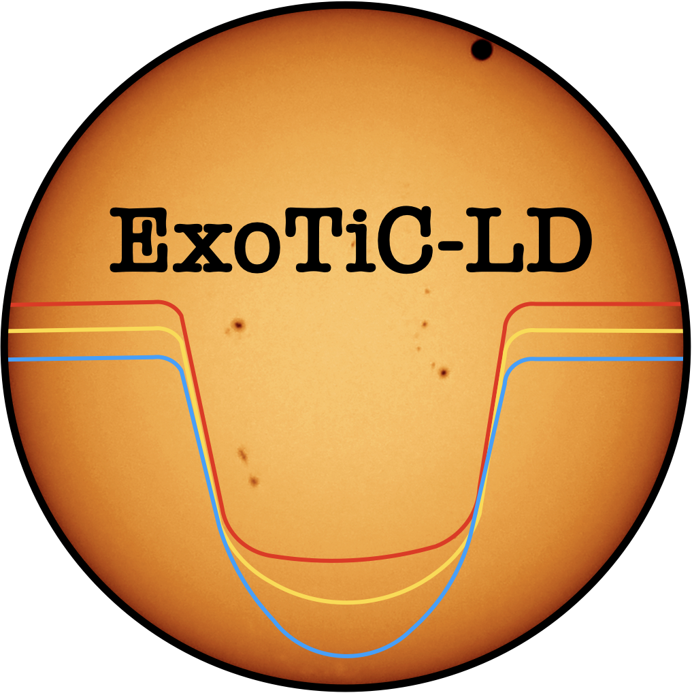

|

**Calculate limb-darkening coefficients for specific instruments, stars, and wavelength ranges.**

.. image:: https://github.com/DavoGrant/ExoTiC-LD/actions/workflows/unittests.yml/badge.svg
   :target: https://github.com/DavoGrant/ExoTiC-LD/actions/workflows/unittests.yml
   
.. image:: https://readthedocs.org/projects/exotic-ld/badge/?version=latest
   :target: https://exotic-ld.readthedocs.io/en/latest/?badge=latest
   
.. image:: https://zenodo.org/badge/DOI/10.5281/zenodo.7437681.svg
   :target: https://doi.org/10.5281/zenodo.7874921
|

::

   pip install exotic-ld

| ExoTiC-LD supports spectroscopic (JWST, HST), photometric (Spitzer, TESS), and custom instrument modes. 
| Read the full documentation at: `exotic-ld.readthedocs.io <https://exotic-ld.readthedocs.io/>`_
